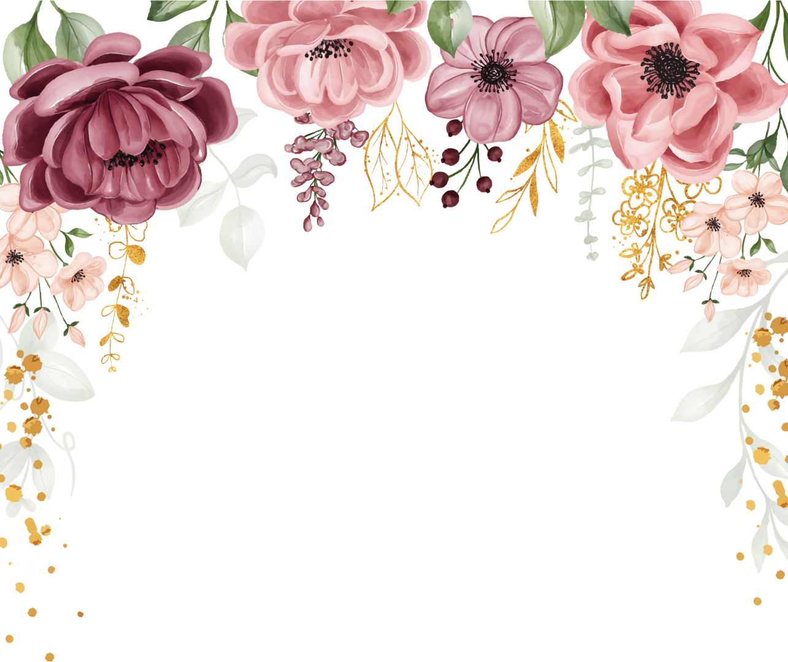
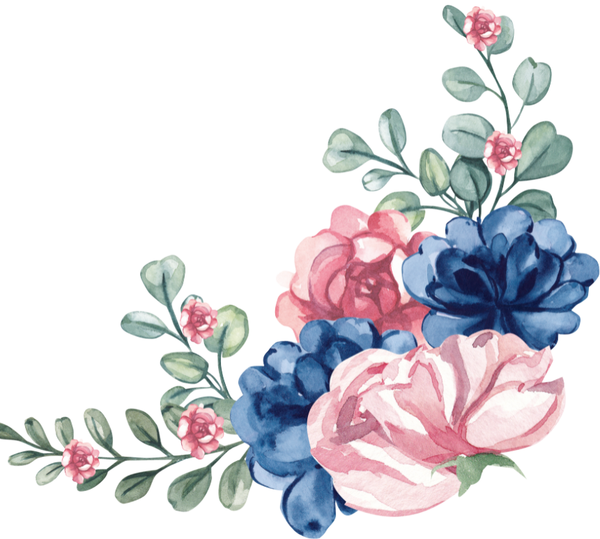
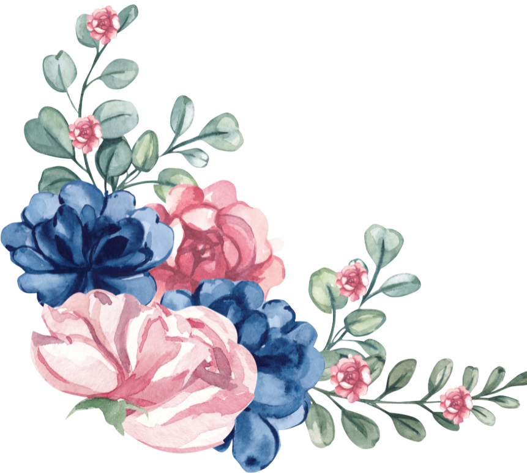
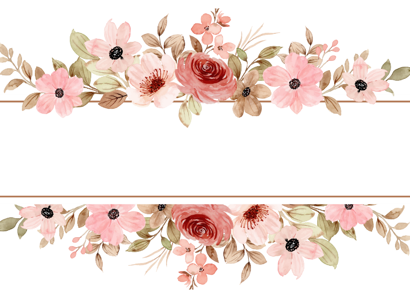

<!DOCTYPE html>
<html lang="en">

<head>
    <meta charset="UTF-8">
    <meta name="viewport" content="width=device-width, initial-scale=1.0">
    <title>Document</title>
    <link rel="stylesheet" href="https://fonts.googleapis.com/css?family=Tangerine">
    <link rel="stylesheet" href="style.css">
</head>

<body>
    

        
        
        

        <h2 style="margin-top: -200px;">From</h2>
        <h2>Robi & Sekar</h2>
        <h2>to</h2>
        

            

            
Your Text Here

            
        

        

            <a class="main-btn" href="invitation.html">Tessdat</a>
        

    

</body>

</html>